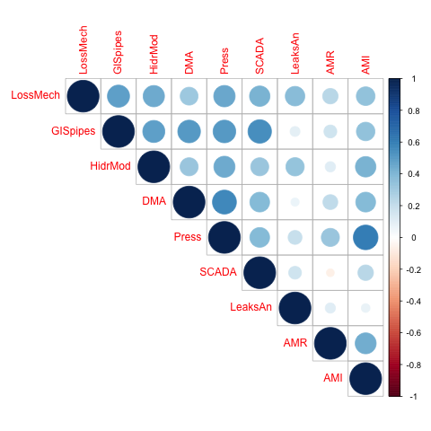

 
# 1/n --- PHASE I (Suppliers)
> Is there a certain hierarchical order observed in the adoption of SWITS as suggested by IADB/WSA? 

_SWIT like GIS, Hydraulic Modeling, Asset Management should be developed in an initial preparation phase prior to implementing a capital intensive SWIT. Figure below shows a flow diagram of suggested preparation and implementation sequence of SWIT._
[see @iadb_evaluation_2017, pp. 41]

<center>

</center>

## Method 1) _CORRELATION AND REGRESSION_

## Correlation found in SWIT adoption
I look for some correlations between various key variables indicating adoption of certain SWIT solutions in the Brazil sample.

#### Assumptions 
+ For simplicity, all variables have been recoded as binary 0/1
	+  1 = (YES) includes {Yes, InConstruciton}
	+  0 = (No) includes  {No, DK} 
+ Based on my understanding of the above, I divide the tools in 3 tiers of increasing complexity/innovation degree.
Tier 1: 
	- LossMech = `Q24_VolLossMech_Has` 
	- GISpipes = `Q58a_GIS_Pipe_Has`
	- HidrMod = `Q60_HidrMod_Has`
Tier 2: 
	- DMA = `Q62_DMA_Has`,
	- Press = `Q65_PressSyst_Has`,
	- SCADA = `Q68_SCADA_UtilLevel`,

+ Tier 3: 
	- LeaksAn = `Q39_LeaksDetection_Analyzed`	
	- AMR = `Q67b_MeterUtilLevel_AMR` Yes = {Allmeters, SomeMeters, InConstr} NO = {Possible, Not USEd, }
	- AMI = `Q67c_MeterUtilLevel_AMI` Yes = {Allmeters, SomeMeters, InConstr} NO = {Possible, Not USEd, }

#### Results correlation
Based on a first check, the adoption of the SWIT technologies shows some expected results. Within tiers there is fairly strong correlation, but not a very noticeable pattern. 

```{r swittiers_cor,  results="asis",  message=FALSE, warning=FALSE}
pacman::p_load(here, corrplot, ggcorrplot) 
load(here::here("output", "swit_sets.Rdata"))

# Building vectors of Variates and their own block corr matrix ----
X1 <- as.matrix(swit_sets[,3:5])   # the foundation SWITs ("LossMech" "GISpipes" "HidrMod")
# colnames(X1)
X2 <- as.matrix(swit_sets[,6:8])   # the foundation++ SWITs ("DMA"   "Press" "SCADA" )
# colnames(X2)
Y <- as.matrix(swit_sets[,9:11])  # the highest level meters ("LeaksAn" "AMR"     "AMI" )
# colnames(Y)

# Correlations Within VARIATES (vectors)  ------------------------------------------
X1_corr <- cor(X1) # fairly high positive corr 
X2_corr <- cor(X2)# fairly high positive corr 
Y_corr <- cor(Y)# fairly high positive corr  (except Leaks An)

All_corr <- cor(swit_sets[ ,3:11])
All_corr

# corrplot(All_corr)

```


<center>

</center>


#### Results logistic regression
I use separate univariate multiple regressions on each of the binary dependent variables in Y (LeaksAn, AMR, AMI), which are considered the highest level of SWIT, to see if there is any effect of the lower tier SWITS.
Nothing seems significant. 

```{r swittiers_reg,  results="asis",  message=FALSE, warning=FALSE}
pacman::p_load(here, stargazer) 

# Separate univariate multiple (LOGIT) regressions
LeaksAn.mod <- glm(LeaksAn  ~  LossMech + GISpipes + HidrMod + DMA + Press + SCADA, data=swit_sets, family = binomial(link="logit"))
# summary(LeaksAn.mod)

# # Marginal effects show the change in probability when the predictor or independent variable increases by one unit. 
# LeaksAn.mod.me <- logitmfx(LeaksAn  ~  LossMech + GISpipes + HidrMod + DMA + Press + SCADA, data=swit_sets)
 
AMR.mod <- glm( AMR  ~  LossMech + GISpipes + HidrMod + DMA + Press + SCADA, data=swit_sets, family = binomial(link="logit"))
#AMR.mod.me <- logitmfx( AMR  ~  LossMech + GISpipes + HidrMod + DMA + Press + SCADA, data=swit_sets)
 

 
AMI.mod <- glm( AMI ~  LossMech + GISpipes + HidrMod + DMA + Press + SCADA, data=swit_sets, family = binomial(link="logit"))
# summary(AMI.mod) 
#AMI.mod.me <- logitmfx( AMI ~  LossMech + GISpipes + HidrMod + DMA + Press + SCADA, data=swit_sets)
 

# 3 Y dep var individually studied
stargazer(LeaksAn.mod, AMR.mod ,AMI.mod, type = "html", digits=2,
			 omit.table.layout = "#",
			 star.cutoffs = c(0.05, 0.01, 0.001),
			 #omit = "Constant",
			 title="Univariate logistic regression models for SWIT most advanced tools")

# stargazer(LeaksAn.mod, AMR.mod ,AMI.mod, type="html", out="logit.htm")

```


## Method 2) _ASSOCIATION RULE MINING_
This hypothesis can be explored borrowing from **Association Rule Mining** (a type of data mining analysis), which has applications in marketing, Market Basket Analysis, and many other industries with large datasets in which there can be association between objects of a set.

> GOAL: identify association rules that fulfill a predetermined level of accuracy in the dataset

One method is the **_APRIORI_ algorithm** (in R pckg `arules::apriori()`) to generate the most relevant set of rules from a given transaction data. It also shows the _support_, _confidence_ and _lift_ of those rules ( i.e., three measure that can be used to decide the relative strength of the rules)

##### Key Metrics
$$Support (item\  or\ itemsets)= \frac{Number\ of\ transactions\ with\ both\ A\ and\ B}{Total\ number\ of\ transactions} = P\left(A \cap B\right)$$

$$Confidence = \frac{Number\ of\ transactions\ with\ both\ A\ and\ B}{Total\ number\ of\ transactions\ with\ A} = \frac{P\left(A \cap B\right)}{P\left(A\right)}$$


$$Expected Confidence = \frac{Number\ of\ transactions\ with\ B}{Total\ number\ of\ transactions} = P\left(B\right)$$

$$Lift = \frac{Support {\left(A \cap B\right)}}{Support(A)*Support (B)} = \frac{P\left(A \cap B\right)}{P\left(A\right)*P\left(B\right)}$$

<!-- ##### Interpretation -->
<!-- Given a set of transactions, there can be a rule like $A=>B[Support, Confidence]$, i.e.  -->

<!-- $iphone=>iphoneCase[Support=20\%,confidence=60\%]$ -->

<!-- we can compute these metrics as: -->

<!-- + $Support$ = 20% of all transaction show this itemset (iphone + iphoneCase)  -->
<!-- + $Confidence$ = 60% of customers who purchase an iphone (Antecedent), buy both iphone + iphoneCase (Consequent)  -->
<!-- + $Lift$ ratio expresses thtetet efficiency of the rule in finddingg cconsequences = the factor by which, the co-occurence of A and B exceeds the expected probability of A and B co-occuring, had they been independent. -->

Hence $Lift >1$ implies a positive relationship (higher than randomly selecting the two items combined)
 
## Association rules found in SWIT adoption
I look at some key variables about adoption of certain SWIT solutions in the Brazil sample (all binary 0/1)

#### Assumptions 
+ I only keep "Has GIS for Pipes", although I have also 3 more variables about GIS (all give the same answer) 
+ For simplicity in making the binary variables:  
	+  1 = (YES) includes {Yes, InConstruciton}
	+  0 = (No) includes  {No, DK} 
+ Min supp = 0.01, 
    minlen = 3,
    maxlen = 5,
    conf = 0.75 # set very high (Stronger rules) 

#### Results
Based on the observations, the adoption of the SWIT technologies shows some expected results, and association patterns in adoption such as 

+ {DMA,  PressSyst ,  AMR}  => {AMI}    
+ {HidrModel,  DMA ,  AMR}  => {PressSyst}  
+ {DMA, SCADA,  AMR}  => {GIS_Pipe}  
+ etc. 

although, when looking at the lift metric it is never higher than 1.7, which indicate weak association rules. 

```{r switgraph,  results="asis",  message=FALSE, warning=FALSE}
pacman::p_load(here, arules, arulesViz) 
load(here::here("output", "swit_t.Rdata"))


# ----- FREQUENT ITEM-SETS with APRIORI
itemsetsAP <- apriori(swit_t,
  parameter = list(
    #target = "frequent itemsets",
    supp = 0.01, # itemset min support
    minlen = 3,
    maxlen = 7,
    conf = 0.75 # set very high (Stronger rules) 
  ),
  control = list(verbose = FALSE)
)
 
# interactive Graph-based VISUALIZATION
top20 <- head(itemsetsAP, n=20, by = "lift")
plot(top20, method = "graph",  engine = "htmlwidget")
```


# i/n --- PHASE I (Suppliers)

If the survey validates the prevailing lack of **efficiency** (high NWR), can we see any correlation with:
<!-- how high is high?  -->

+ company features (ownership, size, state, urban/rural location, network lenght ...)? 
+ human resources (estimated by `staff/served pop ratio`) and  _technical capacity_ (`technical staff/served pop ratio`)?
+ systems in place to monitor (metering, leakage, illegality, customer complaints )?
+ degree of adoption of SWITS / smart technology?
 	
<!-- + ? is the age at all relevant? (2 efficiency etc? ) -->
<!-- + How widespread is metering? (if not enough to catch leakages ... ) -->
<!-- + Is the customer mix (more or less residential relevant)? (2 innovation? / reliability) -->
<!-- + Is the "integration" W & S at all relavant (2 innovation? ) -->


## Process
<!-- - check outliers that could be misleading my summary / correlation -->
<!-- - check correlation  -->
<!-- YES = (Ownership, size, process to detect cland connection)  -->
<!-- NO (% meter, % network yearly inspected, Q24_VolLossMech_Has, Q39_LeaksDetection_Analyzed)  -->
<!-- ? = # staff , ? = SWITS ADOPTION ? = * (?) Is the year of operation * (?) Is thestack of laws connected with efficiency (Expected inverse relation)??  -->

<!-- - DIMENSION REDUCTION  -->
<!-- DECISION TREE / PCA/ MULTIV ANAL /  or some sort of ways to check which explanatory variable is worth keeping  -->

<!-- -  CLUSTER ANALYSIS  -->
<!-- Hierarchical: Start separate and combine -->
<!-- k-means (limited to the NRW related NUMERIC variables? ) -->
<!-- then interpret what you see in the clusters (do they congregate as STATE, ownership, ??? in what % of assigned to cluster 1 are “public”?)  -->

<!-- - DARE I “EXPLAIN”/MODEL  with multivariable regression what “causes” NRW? —— it seems not linear  -->
<!-- OR just “PREDICT” class (>50 NRW // <50 NRW or whatever is the optimal ….. ) based on which info I have ….. I could use BRA as train and MEX as test ????  -->
<!-- LOGISTIC regress  -->


# i/n --- PHASE I (Suppliers)

As a proxy for **reliability**, the surveys asks about service interruptions in the past 12 months, the % of network affected and for how long (days). What are the main causes of service interruption? 
<!-- how high is high? (only 3 never had interruptions)  -->
<!-- how much interruption is acceptable for maintennace  -->
	<!-- + What are the mains reasons?  Maintenance // energy -->
	
+ (Main Reason 1 = maintenance) --> Connection with energy staff _capacity_?  
+ (Main Reason 2 = energy) --> Connection with energy blackouts...? 
 
Can we see any correlation with:
 	+ Degree of independence in governance?
	+ Having (effective) CRM systems in place?

## Process
<!-- - most of them are due to maintenance or energy issue (what does that tell me>?)  -->
<!-- - What do I read on the Desk Research about the Energy issue ? what they say about it ?  -->


<!-- - check outliers that could be misleading my summary / correlation -->
<!-- - check correlation  -->
<!-- YES =   -->
<!-- NO =  -->
<!-- ? = # staff , ? = SWITS ADOPTION ? = * (?) Is the year of operation * (?) Is thestack of laws connected with efficiency (Expected inverse relation)??  -->

<!-- - DIMENSION REDUCTION  -->
<!-- DECISION TREE / PCA/ MULTIV ANAL /  or some sort of ways to check which explanatory variable is worth keeping  -->

<!-- -  CLUSTER ANALYSIS  -->
<!-- Hierarchical: Start separate and combine -->
<!-- k-means (limited to the RELIAB related NUMERIC variables? ) -->
<!-- then interpret what you see in the clusters (do they congregate as STATE, ownership, ??? in what % of assigned to cluster 1 are “public”?)  -->

<!-- - DARE I “EXPLAIN” with multivariable regression what “causes” NRW?  -->


# i/n --- PHASE I (Suppliers)

Certain suppliers involved in alleged **corruption** / changes of ownership occurred around survey 
	+ refer to Desk Research... 


# i/n --- PHASE I (Suppliers) & PHASE 2 (Households)

Explore outcome **affordability** & (possibly) related variables to explore:  
	+ Financial assets
		+ Relevant tariff scheme
	+ Financial efficiency tools
	+ Governance structure  

<!-- # i/n 5: PHASE I (Suppliers) & PHASE 2 (Households) & HISTORICAL DATA 

If I had historical and gegographic data 
	+ What is the effect on key outcome (efficiency / reliab) of the underlying trends of population ? (tot, urban / rural / density)
	 "Pop growth in urban areas has been greater than overal pop growth in most countries between 2000 and 2015"
   +  Are megacities still growing or are the secondary cities appearing?  
				UN DATA (forecast + cities)
				https://population.un.org/wup/Download/
					Total urban rural by country 1950-2050 // urbanization by country 1950-2050
				POPULATION DENSITY FREE data
				http://sedac.ciesin.columbia.edu/data/collection/gpw-v4/sets/browse
				http://nelson.wisc.edu/sage/data-and-models/schneider-readme.php
	 **SAVED STUFF** ./01_rawdata/Hist_GWI_POP/cities_pop_tar.Rdata") with GWI data 2011-2017 + POP data 1950 2035 
 	 https://mran.microsoft.com/snapshot/2015-11-17/web/packages/tmap/vignettes/tmap-nutshell.html
	
	+  Effect of HUMAN MADE OVERARCHING TRENDS? 
	+  NATURAL OVERARCHING TRENDS 
			+ climate change ..
			+ water stress // water scarcity -->


## Process


# i/n --- PHASE I (Suppliers) & PHASE 2 (Households)

4. (In combination PHASE I & PHASE II<!--  // GWI? // Darcia's Note-->) could explore outcome **affordability** & (possibly) related variables to explore:  
	+ Financial assets
		+ Relevant tariff scheme
	+ Financial efficiency tools
	+ Governance structure  


## Process


# i/n --- PHASE I (Suppliers) & PHASE 2 (Households)

4. (In combination PHASE I & PHASE II<!--  // GWI? // Darcia's Note-->) could explore outcome **quality** & (possibly) related variables to explore:  
	+ ...
	+ ...
	+ ...
	


## Process


