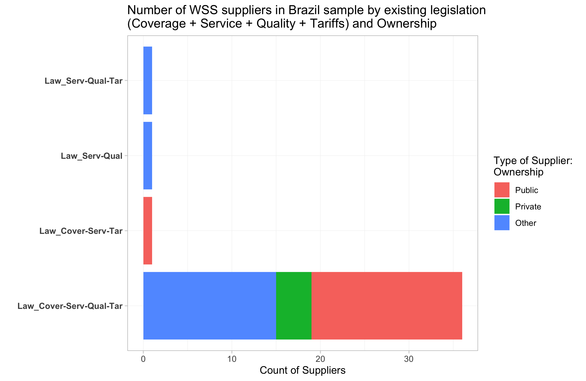
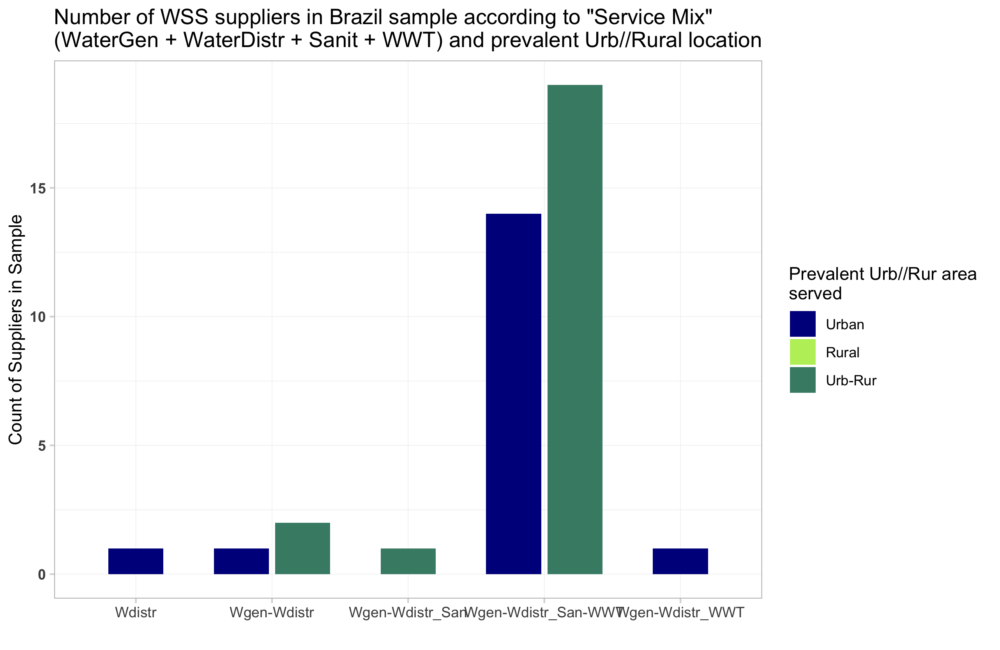
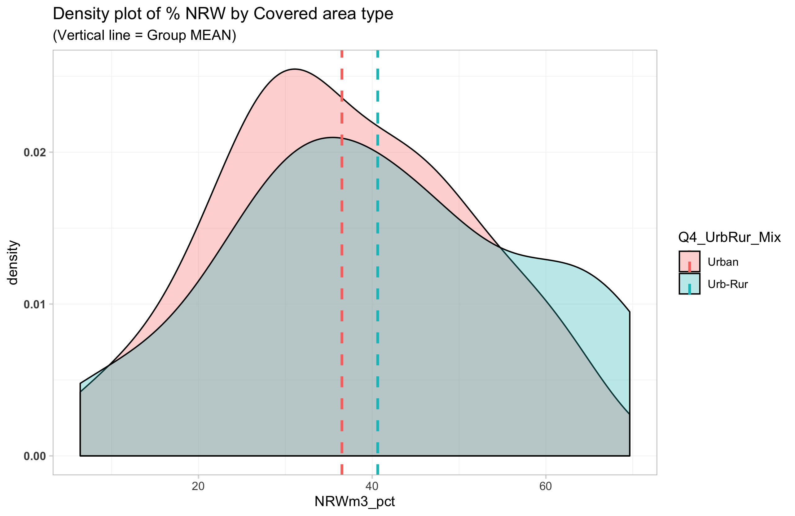
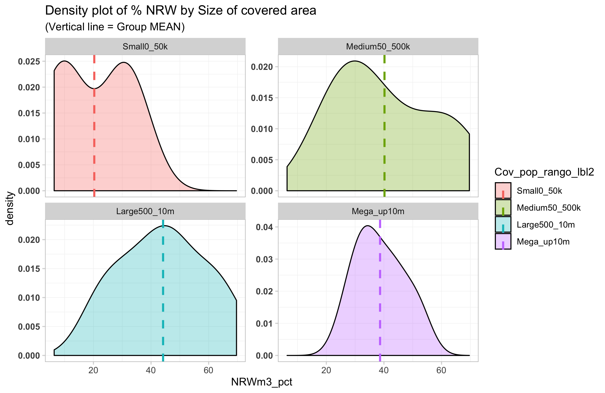
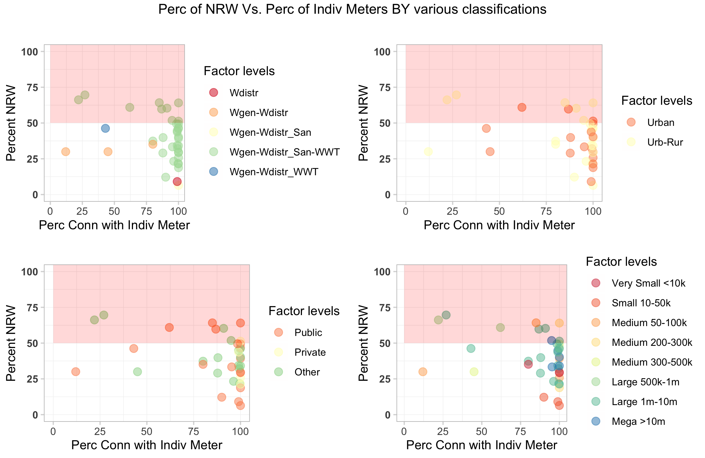
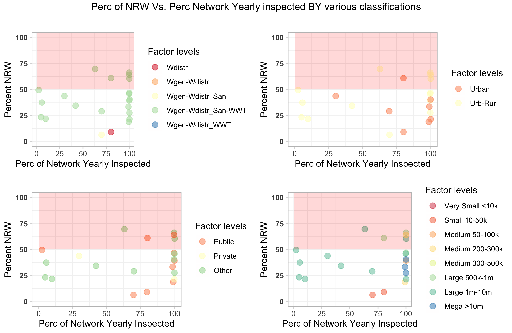
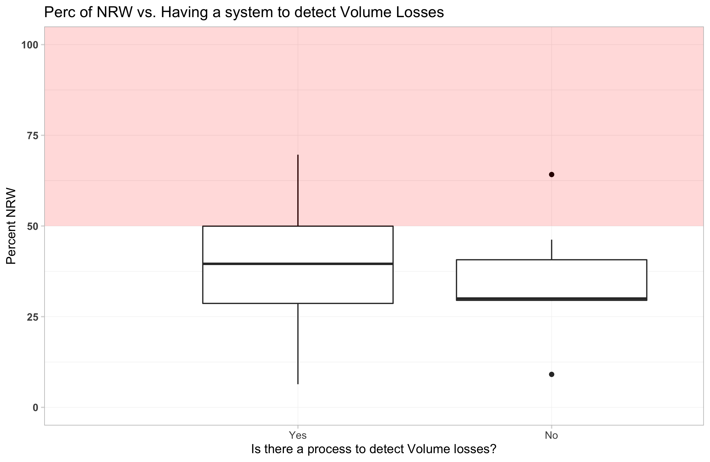
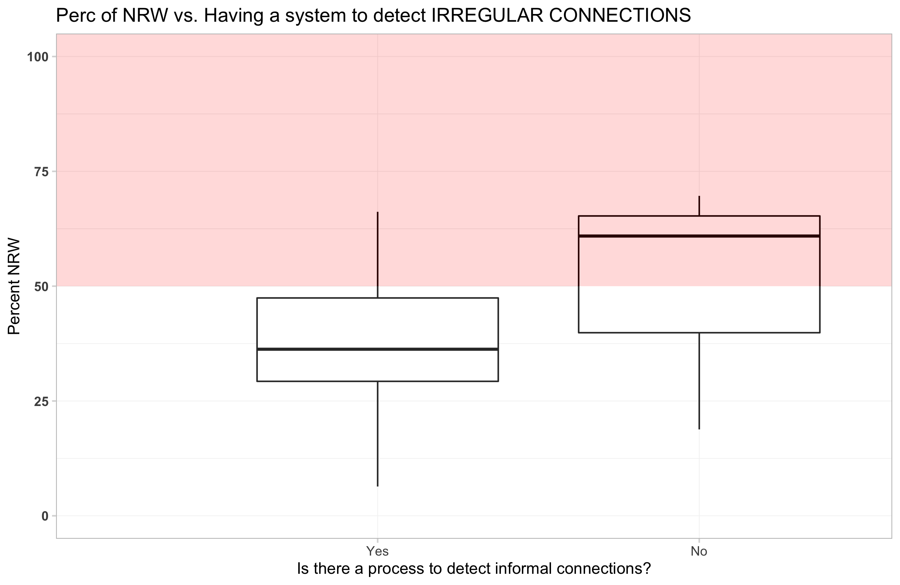

```{r SETUP, message=FALSE, warning=FALSE, include=FALSE }
# BELLO   https://holtzy.github.io/Pimp-my-rmd/#references
# https://stackoverflow.com/questions/43549930/pdf-figures-not-shown-in-html-files-produced-by-rmarkdown-when-open-with-firefox
# to fix issue of picture not rendering TRY 
# devtools::install_github('yihui/knitr')

knitr::opts_chunk$set(fig.retina = 2, # ensure crisp display on retina screens but will double the physical size of your images. 
                      tidy.opts = list(width.cutoff = 120),  # For code
                      options(width = 120) # For output
							 )  

#  The encoding ("ISO-8859-1") is not UTF-8. We will only support UTF-8 in the future. Please re-save your file "sample.Rmd" with the UTF-8 encoding.

# To generate tables using summarytool s own html rendering, the .Rmd document s configuration part (yaml) must point to the package s summarytools.css file.
```

```{r LOADPCK, message=FALSE, warning=FALSE, include=FALSE}
library(tidyverse)
library(stringr)
library(forcats)
library(scales)
library(patchwork)
library(countrycode)
library(sf)
library(here)
library(kableExtra)
library(summarytools)
library(pander)
```


```{r COPYOUTPimage, message=FALSE, include=FALSE}
# # OKKIO, I am in /DataBRA, because it contains a file `.here`, BUT WHEN I COMPILE THE SITE I AM IN /DataBRA/BRAwatersurvey
# library(here)
# here::dr_here(show_reason = T)
# 
# from_dir <- here::here("07_output")
# to_dir <- here::here("BrazilWaterSurvey", "output")
# 
# files <- list.files(path = from_dir , full.names = TRUE) #,  pattern = ".png$" )
# move <- files[sapply(files, file.size) < 100000000] # < 100 MB or Github will get stuck
# 
# # --- SYNTAX
# # file.copy(list.of.files, new.folder)
# 
# file.copy( move, to = to_dir , overwrite = T )
# # if I had listed with full.names = F
# # file.copy( file.path(from_dir, move), to = to_dir  )
```

```{r COPYOUTPdata, message=FALSE, include=FALSE}
# library(here)
# here::dr_here(show_reason = T)
# 
# from_dir2 <- here::here("03_cleandata")
# to_dir2 <- here::here("BrazilWaterSurvey", "data")
# 
# files2 <- list.files(path = from_dir2 , full.names = TRUE, pattern =  ".*\\.Rdata$")  # pattern =  "(^oper|^pres|^Census).*\\.Rdata$") 
# move2 <- files2[sapply(files2, file.size) < 100000000] # < 100 MB or Github will get stuck
# 
# # --- SYNTAX
# # file.copy(list.of.files, new.folder)
# file.copy( move2, to = to_dir2 , overwrite = T )
```


## Descriptive Statistics of Survey WSS Operators Brazil

In observing the survey outcomes, I will try comparing across potential relevant features:

+ **Ownership/type** and 
+ **Size of covered area** 
+ **Service mix** (W/S/W+S)
+ (possibly **Prevalence of urban vs rural coverage vs**)
+ (**Age**?)
+ (**State**) ? 


Here is a very basic distribution of our sampled Suppliers in Brazil, by STATE (UF), Ownership Type and size of Coverage reach

```{r tblcov, results="asis", warning=FALSE}
load(here::here("output", "tbl_uf_own_cov.Rdata"))
# class(tbl_uf_own_cov)
caption <- "Sampled Suppliers in Brazil, by STATE (UF), Ownership Type and size of Coverage reach"
covtable <- pandoc.table.return(tbl_uf_own_cov, 
										  keep.line.breaks = F, 
                                 style = "multiline", 
 										  justify = "lcrr", 
										  caption = caption
										  )

cat(covtable)
```

##  Legislative Context

1. Overall, it seems that the majority of the Suppliers declare they operate in a context where there is legislation for key operational aspects such as:
	+ Coverage Areas
	+ Service 
	+ Quality
	+ Tariffs 
	
	
<center>

</center>

<center>

</center>


## 1) COVERAGE

### Summary of key coverage numeric variable 

+ The WSS suppliers in the sample - as of `r format(Sys.time(), '%B %e, %Y')` - cover an average of *85 municipios* (almost always in one State), corresponding to a mean *covered population of 2,596,772*. 
+ The suppliers on average serve localities that are *84% urban*. 


```{r tbldescstatcov, results="asis", warning=FALSE}
load(here::here("output", "tbl_descstat_cov.Rdata"))
# class(tbl_descstat_cov)

caption <- "Summary of Coverage variables"
var.summary <- pandoc.table.return(tbl_descstat_cov , 
											  keep.line.breaks = TRUE,
											  round = 2,
											  big.mark = ",",
											  justify = "llrrrrrr", # OKKIO AL # DI COLONNE
											  caption = caption, style = "multiline",
											  split.table = Inf
											  )

cat(var.summary)
```


### Area(s) covered vs. service

> Is there any difference between the Product MIX `Q9a_d_Mix_comb` vs the URB-RUR MIX of the supplier `Q4_UrbRur_Mix`[^1]?

There are no suppliers serving exclusively rural area. No remarkable differences in the Product MIX across the URB / RUR MIX types

<center>

</center>

[^1]: Later on, I would like to explore if  _(?) Is the urbanization process (size, local distribution, rate) causing the lack (access, quality, affordability ) to service in the region (controlling for physical assets / hydrological condition, pop #,  etc) ? ??_

> NEXT:... (?) Is the urbanization process (size, local distribution, rate) causing the lack (access, quality, affordability ) to service in the region (controlling for physical assets / hydrological condition, pop #,  etc) ? ??


### Summary of key key service charateristics  

the WSS suppliers in the sample as of `r format(Sys.time(), '%B %e, %Y')`,  ...

```{r tbldescstatcovserv, results="asis", warning=FALSE}
load(here::here("output", "tbl_descstat_covserv.Rdata"))
# class(tbl_descstat_cov)

caption <- "Summary of Service variables"
var.summary <- pandoc.table.return(tbl_descstat_covserv , 
											  keep.line.breaks = TRUE,
											  round = 2,
											  big.mark = ",",
											  justify = "llrrrrrr", # OKKIO AL # DI COLONNE
											  caption = caption, style = "multiline",
											  split.table = Inf
											  )

cat(var.summary)
```


## Zooming in on some interesting SERVICE COVERAGE aspects 


### NRW % levels
> Lit Input: 
Some key determinants of high NRW are: 
1. The cost of implementing counter-measures 
2. A political cost associated with the control of unauthorized consumption in marginalized ares 
3. A cost to those people who benefit from corruption 
4. Technical cost of shortening leakage detection time & improving pressure management (especially when the cost of pumping more raw water is 0 or low) [see @gonzalez-gomez_why_2011, pp. 33-35;  ch. 1].
 


Based on the information collected via the survey, we can estimate NRW as per International Water Association’s (IWA) definition: NRW is defined as water that is placed into a water distribution system that is not billed to customers. 
Our derived indicator is **`NRWm3_pct`** { = (`Q12b_m3_In_Tot` - `Q13_m3_Fatt_Tot`) / `Q12b_m3_In_Tot` *100 }

>>>>> should add a NRW RECAP TABLE HERE >>>>>>>>>> 

Initial exploration shows that: 

1. On average, the % NWR varies quite dramatically across different ownership types (PUBLIC-owned 32%  <  Other 38% < Private 60% (more dispersed))
2. Mean % NWR is lower for suppliers exclusively serving urban areas (34%) than for suppliers servin mixed-urb-rur (43%) ... but sems quite disperserd.
3. On average, the size of served population, is also a great source of variation in the %NRW - highest found in 500-900k size (58%) and smallest in 10-50k size (7%) 
 

<center>

</center>


<center>

</center>

<center>

</center>

### NRW correlation with "suspected" determinant factors 
Visually explore whether the **% of NRW** shows any type of correlation with some variables that could be relevant: 


1. **`Q27_IndivMeter_Perc`**  --> no stryking connection 

<center>

</center>

2.  **`Q40_NetworkYrlyInspected_Perc`**  --> no stryking connection 

<center>

</center>
 

 ---


3. **`Q24_VolLossMech_Has`**  --> most suppliers say "Yes" (have a system to record VOLUME LOSSES)  

<center>

</center>


4. **`Q39_LeaksDetection_Analyzed`**  --> most suppliers say "Yes" (have a systematic campaign to detect ruptures and LEAKS) and those cases show a somewhat lower NRW   

<center>

</center>

5. **`Q41_ClandConn_Analyzed`**  --> the vast majority suppliers say "Yes" (have a system) and those cases show a significantly lower NRW (for now the NO sub-sample is too small to further analyze)

<center>

</center>


>  > NEXT ... Further exploration ..... 
	+ Exist procedim for estimation of vol loss/ (Q24)	  
	*  (?) Is the year of operation anywhere connected with efficiency?  
	*  (?) Is thestack of laws connected with efficiency (Expected inverse relation)?? `Q8a_c_Leg_comb`  `Q8a_LegInst_Cover` `Q8b_LegInst_DirServ` "`Q8c_LegInst_DirQual` `Q8d_LegInst_Tarif`", 
 


### Reliability of the service (Interruptions)
> Lit Input: Performance can improve with: 
1) carefully designed private sector participation in service provision 
2) regulatory agencies that are transparent, accountable, and free of political interference, 
3) strong accountability mechanisms for SOE. [see @andres_uncovering_2013 ].


Y + Reliability = Q4... Q45 interruptions 
X + location 
	+ size 
	+ age? Q6
	+ Quality regulation (q8c)
	+ SWIT penetration ? 
	+ % eng in staff
	+ % IT in staff? 


## 2) SWIT
Use of SSWIT still not widespread for various barriers:

	+ high capital investments
	+ slow cost recovery 
	+ limited technical capacity, particularly for small utilities, 
	+ lack of integration between different technologies


## 3) CORPORATE GOVERNANCE 

Y + Index of regulation (Q8a....Q8d) cumulative
	+ 


## 4) FINANCE 
> Lit Input: 
1) under-investment + dilapidated infrastructure --> INEFFICIENCIES [see @arniella_can_2018 ]
2) Energy consumption much of O&M costs [see @lackey_energy_2017] 


## 5) TARIFFS
> IADB (?): we have no idea if tariffs are low or high in LAC (people say are too low, but in fact they are not showing in the Database) 


## REFERENCE


