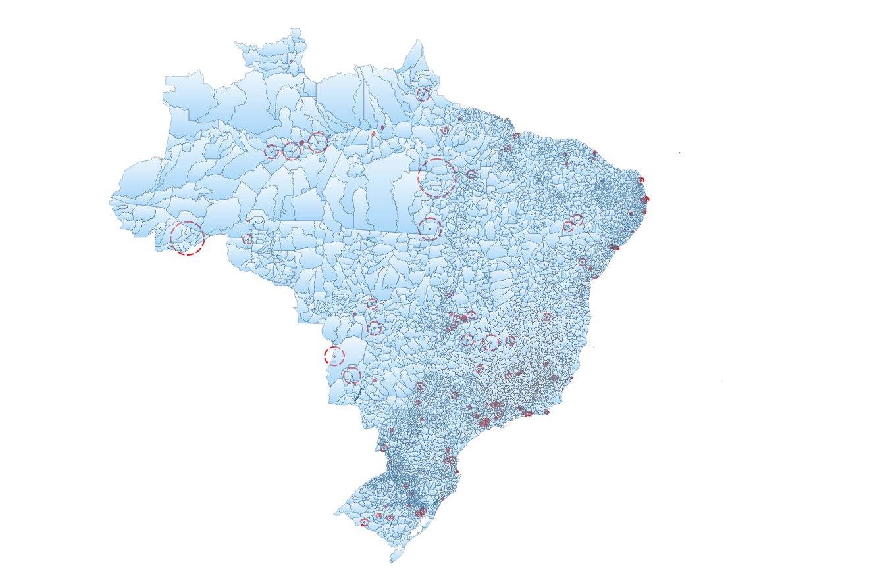

> FOCUS: How we obtained the Sample WSS Operators BRAZIL and what it looks like


```{r SETUP, message=FALSE, warning=FALSE, include=FALSE }
# BELLO   https://holtzy.github.io/Pimp-my-rmd/#references

# https://stackoverflow.com/questions/43549930/pdf-figures-not-shown-in-html-files-produced-by-rmarkdown-when-open-with-firefox
# to fix issue of picture not rendering TRY 
# devtools::install_github('yihui/knitr')

knitr::opts_chunk$set(fig.retina = 2, # will ensure crisp display on retina screens but be aware that it will double the physical size of your images. 
                      tidy.opts = list(width.cutoff = 120),  # For code
                      options(width = 120) # For output
							 )  

#  The encoding ("ISO-8859-1") is not UTF-8. We will only support UTF-8 in the future. Please re-save your file "sample.Rmd" with the UTF-8 encoding.

# To generate tables using summarytool s own html rendering, the .Rmd document s configuration part (yaml) must point to the package s summarytools.css file.
```

```{r LOADPCK, message=FALSE, warning=FALSE, include=FALSE}
if (!require("pacman")) {
	install.packages('pacman' )
}


library(pacman) # for loading packages
p_load(tidyverse,
		 stringr,
		 forcats,
		 scales,
		 patchwork,
		 countrycode,
		 sf,
		 here,
		 kableExtra,
		 summarytools) 
```


```{r COPYOUTPimage, message=FALSE, include=FALSE}
# # OKKIO, I am in /DataBRA/, because it contains a file `.here` (WONT WORK if Knitr, only rendering)
# library(here)
# here::dr_here(show_reason = T)
# 
# from_dir <- here::here("07_output")
# to_dir <- here::here("BrazilWaterSurvey", "output")
# 
# files <- list.files(path = from_dir , full.names = TRUE) #,  pattern = ".png$" )
# move <- files[sapply(files, file.size) < 100000000] # < 100 MB or Github will get stuck
# 
# # --- SYNTAX
# # file.copy(list.of.files, new.folder)
# 
# file.copy( move, to = to_dir , overwrite = T )
# # if I had listed with full.names = F
# # file.copy( file.path(from_dir, move), to = to_dir  )
```

```{r COPYOUTPdata, message=FALSE, include=FALSE}
# library(here)
# here::dr_here(show_reason = T)
# 
# from_dir2 <- here::here("03_cleandata")
# to_dir2 <- here::here("BrazilWaterSurvey", "data")
# 
# files2 <- list.files(path = from_dir2 , full.names = TRUE, pattern =  ".*\\.Rdata$")  # pattern =  "(^oper|^pres|^Census).*\\.Rdata$") 
# move2 <- files2[sapply(files2, file.size) < 100000000] # < 100 MB or Github will get stuck
# 
# # --- SYNTAX
# # file.copy(list.of.files, new.folder)
# file.copy( move2, to = to_dir2 , overwrite = T )
```


## Sampling design

1. The sample for the survey is mutuated from the sampling design of LAPOP because the goal is to survey the WSSS providers in the _same_ areas where LAPOP was interviewing households. LAPOP households interviews covered **1,563 IDs** located in **250 clusters**, found in **107 municipios**.[^1] 

	+ UPDATE FROM LAPOP 2019: LAPOP households interviews covered **1,498 IDs** located in **125 clusters**, found in **107 municipios**.[^2] 

[^1]: This information was retrieved from the STATA files with the sample of BRAZIL 2016. 
[^2]: This information was retrieved from the STATA files with the sample of BRAZIL 2018. 

LAPOP provided a file with geofences that indicate a circle containing each cluster in 2016 (might be slightly changed in 2018) 


### Spatial identification of LAPOP hh clusters


<center>

</center>
```{r explan, eval=FALSE, message=FALSE, warning=FALSE, include=FALSE, paged.print=FALSE}
# This was created via QGIS {in ./01_rawdata/BRA_fences_2016.qgz} where I added 
# 1. the LAPOP TRacks and waypoints from 2016 (I guess taken from Google Earth)
# 2. The IBGE UF and munic shp (2017 )
```

2. Based on those, we identified the (expected) clusters for POPA 2018 sample & matched each location with the pertinent WSS Supplier in the area. 
We arrived to a sample of **45 different suppliers** in the sample of which **39 successfully completed interviews**.[^3] 

[^3]: At beginning, we assumed there were 54 suppliers in the covered area. Then POPA noticed some companies were controlled by other companies, so less interviews would be needed (from 54 to 48). During fieldwork, similar situations were found which reduced the number to 45 entities. 6 from those were lost/rejected, so we should have at the end of this Phase in Brazil, 39 completes on the database.  

3. We asked to the suppliers interviewed to confirm the list of municipios they serve, so that to have a precise understanding of the respective area of coverage. 

```{r explan2, eval=FALSE, message=FALSE, warning=FALSE, include=FALSE, paged.print=FALSE}
# In order to match our sample to official Brazil admin boundaries of municipios (as in Census 2017), I downloaded from IBGE _{./01_rawdata/IBGE_regioes}_ the ID keys and shapefiles (polygons) for: 
#     . RG2017_regioesgeograficas2017_20180911.shp = Regiões Geográficas Composição por **Municípios** - 2017 (5570)
#     . RG2017_rgi_20180911.shp = Limite das **Regiões Geográficas Imediatas** - 2017 (510)
#     . RG2017_rgint_20180911.shp = Limite das **Regiões Geográficas Intermediárias** - 2017 (133)
```

### Which Unidades Federales (UF) and Municipios are covered by the Sample

> The States (UF) _currently_ covered by the sample are **27** (all)  
	 

```{r,  echo=FALSE, fig.cap="The ENTIDADES which include LAPOP clusters by # of hh interviewed in 2016", out.width = '100%', results='asis'}

# knitr::include_graphics(paste0(to_dir,"/01_tmap_PopaSampleE.png"))   # NOT RENDERING 

### #list.files(path = to_dir)
```	
	
<center>

</center>

> The Municipios _currently_ covered by the sample are **2,955**  (out of 5,770) 

<center>

</center>

4. This survey encompasses two main goals

	+ I) Survey of WSS suppliers 
	+ II) Survey of small samples of househods served by the above suppliers (also a chance to validate the LAPOP hh survey in the same areas)
	
What follows is a preliminary analysis of the 2 respective samples. 


## (PHASE I) The Water & Sanitation Providers 

>>> complete for Brazil!!!!

#### The universe of WSS suppliers in Brazil

<!-- SOURCE????  has identified a total of _xxxxxxx  "Organismos Operadores"_ (OO) in the _"xxxxxxxxxx"_  -->
<!-- conducted in xxxx and published in xxxx [ @x ].    -->


<!-- + JURIDICAL CATEGORY: -->
<!-- 	* -->
<!-- 	*  -->
<!-- 	*  -->


<!-- + GEOGRAPHIC COVERAGE: -->
<!-- 	*  -->
<!-- 	* Cabecera Municipal + some other localidades (892 out of  2668) -->
<!-- 	* Whole Municipio (350 out of  2668) -->
<!-- 	* Intermunicipal  -->
<!-- 	* Whole Entidad Federativa -->
<!-- 	* Rural  -->
<!-- 	* Otros (201 of 2668) -->

<!-- + EMPLOYED PERSONNEL: -->
<!-- 	* personal ocupado por sexo; 81.3% con trabajadores hombres y 18.7% mujeres -->
<!-- 	* obreros y técnicos; 76,744 obreros y técnicos (62.5%)/un total de 117 866 puestos de trabajo -->
<!-- 	* empleados y directivos;  -->
<!-- 	* ~~personal no remunerado~~ 3,764 trabaja- dores no remunerados/un total de 117 866 puestos de trabajo -->
<!-- 	* ~~promedio de horas trabajadas~~  -->
<!-- 	* ~~personal no dependiente de la razón social~~  -->
<!-- 	* ~~remuneraciones pagadas~~  -->
<!-- 	* ~~prestaciones sociales~~  -->
<!-- 	* ~~pago al personal subcontratado.~~ -->

<!-- + INGRESOS POR CONSUMO DE BIENES Y SERVICIOS: -->
<!-- 	* Suministro de agua 69.3% -->
<!-- 	* Derechos de conexión y alcantarillado 2.1% -->
<!-- 	* Ingresos por ejercicios anteriores 9.2% -->
<!-- 	* Otros Venta de agua tratada 7.6% -->

<!-- + Tomas de agua por tipo de usuario -->
<!--  	* Toma doméstica 92.1% -->
<!-- 	* Toma comercial 6.3 %  -->
<!-- 	* Toma industrial 0.6 % -->
<!-- 	* Toma de servicios públicos 1 %  -->

<!-- + Distribución porcentual de los ingresos según la venta de agua potable por tipo de usuario -->
<!-- 	* Toma doméstica 60.9 % -->
<!-- 	* Toma comercial 25.3 % -->
<!-- 	* Toma industrial 8.1 % -->
<!-- 	* Toma de servicios públicos 5.7 % -->


#### THE SUPPLIERS IN OUR SAMPLE 

>>> complete for Brazil!!!!

+ JURIDICAL CATEGORY ("TIPO")  
+ ... 


	
```{r OperTIPO, echo=FALSE, message=FALSE, results = 'asis'}
#load( here::here( "BrazilWaterSurvey", "data", "Bra1_complete.Rdata"))
load( here::here(  "data", "Bra1_complete.Rdata"))

# Graph distribution by service provided 


 
# # https://cran.r-project.org/web/packages/summarytools/vignettes/Introduction.html
# library(summarytools)
# Freq_Tipo <- summarytools::freq(prestadores_Popa_UTF$Tipo_lbl , 
# 			  report.nas = FALSE, 
# 			round.digits = 2, # default 2
# 			order = "freq", #  
# 			style = 'rmarkdown', #  
# 			 omit.headings = T
# 			) 
# 
# # ======= DOES NOT RENDER IN SITE 
# # # Then use view(), like so:
# #view(Freq_Tipo, method = "pander", style = "rmarkdown", omit.headings = TRUE	)
# # 
# # print(Freq_Tipo, style = "rmarkdown", report.nas = FALSE, 
#  #                totals = FALSE, omit.headings = TRUE)
# # # # print(FreqTipo)
# # # 
# # kable(Freq_Tipo) %>%
# #   kable_styling("striped", full_width = F, latex_options = "scale_down")   
# 
# # ======= WORKS (locally not in site) BUT WIHT EXTRA COLUMNS I DONT WANT 
#  knitr::kable(Freq_Tipo,
# 				 format = "html",
# 				 digits = 2,
# 				 caption = "Agencies Providing Water & Sanitation by Type (Including when Not properly defined") %>%
# 	kable_styling("striped", full_width = F) %>%
# 	row_spec(1, bold = T, color = "white", background = "#D7261E") %>%
# 	row_spec(5, bold = T,   background = "#FFC1C1")%>%
# 	row_spec(9, bold = T,  background = "#FFC1C1")
```

+ "RANGO" refers to the size of the population served.  


```{r OperRANGO, echo=FALSE, message=FALSE, results = 'asis'}

# load( here( "data", "prestadores_Popa_UTF.Rdata"))
# 
# # https://cran.r-project.org/web/packages/summarytools/vignettes/Introduction.html
# library(summarytools)
# Freq_Rango <- summarytools::freq(prestadores_Popa_UTF$Rango_lbl , 
# 			 report.nas = FALSE, 
# 			round.digits = 2, # default 2
# 			order = "freq", #  
# 			 style = 'rmarkdown', #  
# 			 omit.headings = T
# 			) 
# 
# # ======= DOES NOT RENDER IN SITE 
# # # Then use view(), like so:
# # view(Freq_Tipo, method = "pander", style = "rmarkdown", omit.headings = TRUE)
# # 
# # print(Freq_Tipo, style = "rmarkdown", report.nas = FALSE, 
# #                  totals = FALSE, omit.headings = TRUE)
# # # print(FreqTipo)
# # 
# # kable(FreqTipo) %>%
# #   kable_styling("striped", full_width = F, latex_options = "scale_down") # %>%
# #   #   row_spec(11, bold = T, color = "white", background = "#D7261E")
# 
# # ======= WORKS BUT WIHT EXTRA COLUMNS I DONT WANT
# knitr::kable(Freq_Rango,
# 				 format = "pandoc",
# 				 digits = 2,
# 				 caption = "Agencies Providing Water & Sanitation by size of population served (Including when Not properly defined")
# 
# # st_options()
```

#### Recent mergers of suppliers changed the landscape

>>> retrieve information from Desk REsearch .... 


## (PHASE II) The households served in the respective service areas of the surveyed Water & Sanitation Providers 

### Which households? 
>>> complete for Brazil!!!!

The sample selected is made of *" .... "* 

### How many? 

1) Para o Brasil foi considerada a amostra de *1500 domicilios* com 12 domicilios distribuidos pelos *107 municipios* determinados.


 
<!-- <center> -->
<!--   -->
<!-- </center> -->


```{r,  echo=FALSE, fig.cap="The MUNICIPIOS which include LAPOP clusters by # of hh interviewed in 2016", out.width = '100%', results='asis'}
# knitr::include_graphics(paste0(to_dir,"/01_tmap_PopaSampleM.png")) # NOT RENDERING 

### #list.files(path = to_dir)
```	

<!-- <center> -->
<!--   -->
<!-- </center> -->


### Changes occurred between 2000-2010 in areas of interest

Look at Changes in ENTIDADES and MUNICIPIOS covered by LAPOP/POPA clusters according to census 2010 compared to census 2000


```{r CensusVar, echo=FALSE}
#   
# # https://rpubs.com/Xavi/ubiss16d3
# # https://walkerke.github.io/2016/12/rmd-dropdowns/
# load( here( "data", "Census_2yrs_p_lag_pcg.Rdata"))
# 
# CensusVars <- colnames(Census_2yrs_p_lag_pcg[9:55])
# UnitOfAn <- c( "Total per municipio","Total per municipio","Total per municipio",
# 					  "Total per municipio","Total per municipio", "Lag Total per municipio",
# 					"Percentage Change 2010 over 2000", 
# 					  "Total per municipio", "Percent per municipio 2000","Percentage Change 2010 over 2000", 
# 					  "Total per municipio", "Percent per municipio 2000","Percentage Change 2010 over 2000", 
# 					  "Percent per municipio 2010", "Percent per municipio 2000","Percentage Points Change (%2010 - %2000)", 
# 					  "Percent per municipio 2010", "Percent per municipio 2000","Percentage Points Change (%2010 - %2000)", 
# 					  "Percent per municipio 2010", "Percent per municipio 2000","Percentage Points Change (%2010 - %2000)", 
# 					  "Percent per municipio 2010", "Percent per municipio 2000","Percentage Points Change (%2010 - %2000)", 
# 					  "Percent per municipio 2010", "Percent per municipio 2000","Percentage Points Change (%2010 - %2000)", 
# 					  "Percent per municipio 2010", "Percent per municipio 2000","Percentage Points Change (%2010 - %2000)", 
# 					  "Percent per municipio 2010", "Percent per municipio 2000","Percentage Points Change (%2010 - %2000)", 
# 					  "Percent per municipio 2010", "Percent per municipio 2000","Percentage Points Change (%2010 - %2000)",
# 					  "Percent per municipio 2010", "Percent per municipio 2000","Percentage Points Change (%2010 - %2000)",
# 					 					  "Percent per municipio 2010", "Percent per municipio 2000","Percentage Points Change (%2010 - %2000)",					  "Percent per municipio 2010", "Percent per municipio 2000","Percentage Points Change (%2010 - %2000)" )
# 
# CensusLegend <- cbind(CensusVars, UnitOfAn)
# colnames(CensusLegend) <- c("Variable Code", "Variable Type")
# knitr::kable(CensusLegend, caption = "Variables - aggreagated at \"municipio\" level - retrieved from Census 2000 2010")

```


## REFERENCE


```{r knitAttempt, echo = F, eval=F}
# knitr::knit2html('./sample.Rmd',encoding = 'UTF-8',force_v1 = TRUE)
```

